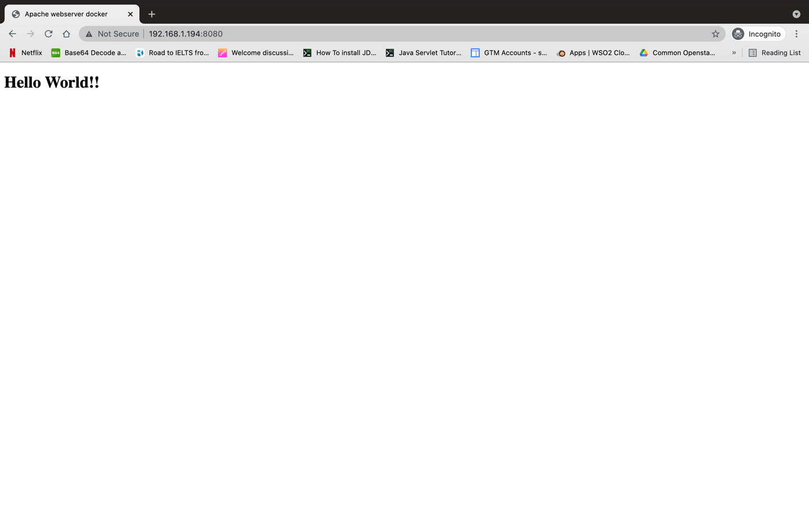

# Create apache web server image - Docker

## Author:
Piyum Sithumini Senevirathne

## The Task:

- Create a Dockerfile , that installs apache httpd.
- The apache will render “Hello World” html file, that is found next to the Dockerfile (meaning, it needs to be copied into the container.)

## Prerequisites

#### Docker installation on your machine
Check your current docker version by running below command in your terminal
```
docker -v
```
# Create an Apache webserver installed container by manual commands

## Step 1 : Get the latest Centos Docker image

Docker pull command used to download the latest Centos image from Docker Hub repositories
* Run below command to pull the latest Centos image

```
    docker pull centos:latest
```

* You should get an output similar to below

````
latest: Pulling from library/centos
Digest: sha256:5528e8b1b1719d34604c87e11dcd1c0a20bedf46e83b5632cdeac91b8c04efc1
Status: Image is up to date for centos:latest
````

### Check the centos images list

* Run below command to pull the latest Centos image

```
    docker images centos
```

* You should get an output similar to below

````
~/Documents/docker-projects/apache-webserver-docker-image » docker images centos                                                                                                       sithumini@Sithuminis
REPOSITORY          TAG                 IMAGE ID            CREATED             SIZE
centos              latest              300e315adb2f        * months ago        209MB
centos              centos7             1e1148e4cc2c        * days ago         202MB````
````

## Step 2 : Run the Docker image
* Run below command to run the docker image,


    `docker run -it --name apache-webserver centos:latest`


* -it : Argument used to allocate a bash shell and take standard input.
* -- name : Argument used to tag a name to the running container.


* You should get an output similar to below

````
~/apache-webserver-docker-image » docker run -it --name apache-webserver centos:latest                                                                          sithumini@Sithuminis
root@cb84b6dabd6f:/#
````

## Step 3 : Install Apache webserver and all dependencies

* Run below command to install the apache webserver,

  `yum install httpd –y`
  

* You should get an output similar to below

````
[root@ce06023bc77d /]# yum install httpd -y
Failed to set locale, defaulting to C.UTF-8
Last metadata expiration check: 0:00:33 ago on Mon Jul 19 02:28:28 2021.
Dependencies resolved.
============================================================================================================================================================================================================
 Package                                          Architecture                         Version                                                                Repository                               Size
============================================================================================================================================================================================================
Installing:
 httpd                                            x86_64                               2.4.37-39.module_el8.4.0+778+c970deab                                  appstream                               1.4 M
Installing dependencies:
 apr                                              x86_64                               1.6.3-11.el8                                                           appstream                               125 k
 apr-util                                         x86_64                               1.6.1-6.el8                                                            appstream                               105 k
 brotli                                           x86_64                               1.0.6-3.el8                                                            baseos                                  323 k
 centos-logos-httpd                               noarch                               85.8-1.el8                                                             baseos                                   75 k
 httpd-filesystem                                 noarch                               2.4.37-39.module_el8.4.0+778+c970deab                                  appstream                                38 k
 httpd-tools                                      x86_64                               2.4.37-39.module_el8.4.0+778+c970deab                                  appstream                               106 k
 mailcap                                          noarch                               2.1.48-3.el8                                                           baseos                                   39 k
 mod_http2                                        x86_64                               1.15.7-3.module_el8.4.0+778+c970deab                                   appstream                               154 k
Installing weak dependencies:
 apr-util-bdb                                     x86_64                               1.6.1-6.el8                                                            appstream                                25 k
 apr-util-openssl                                 x86_64                               1.6.1-6.el8                                                            appstream                                27 k
Enabling module streams:
 httpd                                                                                 2.4

Transaction Summary
============================================================================================================================================================================================================
Install  11 Packages

Total download size: 2.4 M
Installed size: 7.1 M
Downloading Packages:
(1/11): apr-1.6.3-11.el8.x86_64.rpm                                                                                                                                         1.0 MB/s | 125 kB     00:00
(2/11): apr-util-1.6.1-6.el8.x86_64.rpm                                                                                                                                     709 kB/s | 105 kB     00:00
(3/11): apr-util-bdb-1.6.1-6.el8.x86_64.rpm                                                                                                                                 164 kB/s |  25 kB     00:00
(4/11): apr-util-openssl-1.6.1-6.el8.x86_64.rpm                                                                                                                             584 kB/s |  27 kB     00:00
(5/11): httpd-tools-2.4.37-39.module_el8.4.0+778+c970deab.x86_64.rpm                                                                                                        378 kB/s | 106 kB     00:00
(6/11): httpd-filesystem-2.4.37-39.module_el8.4.0+778+c970deab.noarch.rpm                                                                                                   120 kB/s |  38 kB     00:00
(7/11): mod_http2-1.15.7-3.module_el8.4.0+778+c970deab.x86_64.rpm                                                                                                           1.5 MB/s | 154 kB     00:00
(8/11): brotli-1.0.6-3.el8.x86_64.rpm                                                                                                                                       2.2 MB/s | 323 kB     00:00
(9/11): centos-logos-httpd-85.8-1.el8.noarch.rpm                                                                                                                            996 kB/s |  75 kB     00:00
(10/11): mailcap-2.1.48-3.el8.noarch.rpm                                                                                                                                    2.0 MB/s |  39 kB     00:00
(11/11): httpd-2.4.37-39.module_el8.4.0+778+c970deab.x86_64.rpm                                                                                                             1.6 MB/s | 1.4 MB     00:00
------------------------------------------------------------------------------------------------------------------------------------------------------------------------------------------------------------
Total                                                                                                                                                                       1.8 MB/s | 2.4 MB     00:01
warning: /var/cache/dnf/appstream-02e86d1c976ab532/packages/apr-1.6.3-11.el8.x86_64.rpm: Header V3 RSA/SHA256 Signature, key ID 8483c65d: NOKEY
CentOS Linux 8 - AppStream                                                                                                                                                  1.6 MB/s | 1.6 kB     00:00
Importing GPG key 0x8483C65D:
 Userid     : "CentOS (CentOS Official Signing Key) <security@centos.org>"
 Fingerprint: 99DB 70FA E1D7 CE22 7FB6 4882 05B5 55B3 8483 C65D
 From       : /etc/pki/rpm-gpg/RPM-GPG-KEY-centosofficial
Key imported successfully
Running transaction check
Transaction check succeeded.
Running transaction test
Transaction test succeeded.
Running transaction
  Preparing        :                                                                                                                                                                                    1/1
  Installing       : apr-1.6.3-11.el8.x86_64                                                                                                                                                           1/11
  Running scriptlet: apr-1.6.3-11.el8.x86_64                                                                                                                                                           1/11
  Installing       : apr-util-bdb-1.6.1-6.el8.x86_64                                                                                                                                                   2/11
  Installing       : apr-util-openssl-1.6.1-6.el8.x86_64                                                                                                                                               3/11
  Installing       : apr-util-1.6.1-6.el8.x86_64                                                                                                                                                       4/11
  Running scriptlet: apr-util-1.6.1-6.el8.x86_64                                                                                                                                                       4/11
  Installing       : httpd-tools-2.4.37-39.module_el8.4.0+778+c970deab.x86_64                                                                                                                          5/11
  Installing       : mailcap-2.1.48-3.el8.noarch                                                                                                                                                       6/11
  Installing       : centos-logos-httpd-85.8-1.el8.noarch                                                                                                                                              7/11
  Installing       : brotli-1.0.6-3.el8.x86_64                                                                                                                                                         8/11
  Running scriptlet: httpd-filesystem-2.4.37-39.module_el8.4.0+778+c970deab.noarch                                                                                                                     9/11
  Installing       : httpd-filesystem-2.4.37-39.module_el8.4.0+778+c970deab.noarch                                                                                                                     9/11
  Installing       : mod_http2-1.15.7-3.module_el8.4.0+778+c970deab.x86_64                                                                                                                            10/11
  Installing       : httpd-2.4.37-39.module_el8.4.0+778+c970deab.x86_64                                                                                                                               11/11
  Running scriptlet: httpd-2.4.37-39.module_el8.4.0+778+c970deab.x86_64                                                                                                                               11/11
  Verifying        : apr-1.6.3-11.el8.x86_64                                                                                                                                                           1/11
  Verifying        : apr-util-1.6.1-6.el8.x86_64                                                                                                                                                       2/11
  Verifying        : apr-util-bdb-1.6.1-6.el8.x86_64                                                                                                                                                   3/11
  Verifying        : apr-util-openssl-1.6.1-6.el8.x86_64                                                                                                                                               4/11
  Verifying        : httpd-2.4.37-39.module_el8.4.0+778+c970deab.x86_64                                                                                                                                5/11
  Verifying        : httpd-filesystem-2.4.37-39.module_el8.4.0+778+c970deab.noarch                                                                                                                     6/11
  Verifying        : httpd-tools-2.4.37-39.module_el8.4.0+778+c970deab.x86_64                                                                                                                          7/11
  Verifying        : mod_http2-1.15.7-3.module_el8.4.0+778+c970deab.x86_64                                                                                                                             8/11
  Verifying        : brotli-1.0.6-3.el8.x86_64                                                                                                                                                         9/11
  Verifying        : centos-logos-httpd-85.8-1.el8.noarch                                                                                                                                             10/11
  Verifying        : mailcap-2.1.48-3.el8.noarch                                                                                                                                                      11/11

Installed:
  apr-1.6.3-11.el8.x86_64                                       apr-util-1.6.1-6.el8.x86_64                                              apr-util-bdb-1.6.1-6.el8.x86_64
  apr-util-openssl-1.6.1-6.el8.x86_64                           brotli-1.0.6-3.el8.x86_64                                                centos-logos-httpd-85.8-1.el8.noarch
  httpd-2.4.37-39.module_el8.4.0+778+c970deab.x86_64            httpd-filesystem-2.4.37-39.module_el8.4.0+778+c970deab.noarch            httpd-tools-2.4.37-39.module_el8.4.0+778+c970deab.x86_64
  mailcap-2.1.48-3.el8.noarch                                   mod_http2-1.15.7-3.module_el8.4.0+778+c970deab.x86_64

Complete!
[root@ce06023bc77d /]#
````

# configure the webpage
## Step 4 : Create the webpage

* Create an index.html page in the location /var/www/html/
* Run below command to create the html page,
  
  
````
    vi /var/www/html/index.html
````

* Type the below and save the html page,

````
<!DOCTYPE html>
<html lang="en">
<head>
    <meta charset="UTF-8">
    <title>Apache webserver docker</title>
</head>
<body>
    <h1>Hello World!!</h1>
</body>
</html>
````

## Step 5 : Exit the running container

* Run below command to exit the container,

    `exit`
    
# Create a new customized docker image

## Step 6 : Make a new customized docker image using docker commit command

* Run below command to build the new image,
  
````
  docker commit <container_id or container_name> <New image name>:<version>
  
  docker commit apache-webserver apache-webserver:v1
````
  
* You should get an output similar to below

````
sha256:a93aaff0bc0c870b3b81fc1f965df2e3e531b60f667ae7878c87e3caa5cb2ceb
````

````
REPOSITORY                                      TAG                 IMAGE ID            CREATED              SIZE
apache-webserver                                v1                  a93aaff0bc0c        About a minute ago   255MB
````

# Launching the webserver

## Step 7 : Launching the webserver using the created image

* Run below command to launch the webserver,

````
  docker run -p 8080:80 apache-webserver:v1 /usr/sbin/httpd -D FOREGROUND
````

* /usr/sbin/httpd –D FOREGROUND : command to start the webserver

* You should get an output similar to below
````
~/apache-webserver-docker-image » docker run -p 8080:80 apache-webserver:v1 /usr/sbin/httpd -D FOREGROUND                                                    
AH00558: httpd: Could not reliably determine the server's fully qualified domain name, using 172.17.0.3. Set the 'ServerName' directive globally to suppress this message
````

# View the result in web browser

## Step 8 : Launching the webserver using the created image

* Open your web browser
* Type the url below,

` http://<host ip>:8080/`

* You should get an output similar to below



# Get the image from Docker hub

* You can pull the image from below Docker hub repository location

```
https://hub.docker.com/repository/docker/sithuminis/webserver
```

# Additional commands to save, copy to new system and load the image

## Save the Docker image as a tar file

* Run below command to save the image,
````
docker save -o apache-webserver.tar centos:latest apache-webserver:v1
````
## Copy the image to a new system

* Copy the image to a new system with regular file transfer tools such as cp, scp or rsync (preferred for big files).

## Load the image into Docker

* Run below command to load the image into docker,

````
docker load -i <path to image tar file>
````
